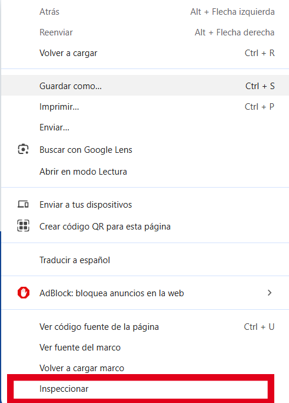

## Métodos para Abrir el Inspector

### 🔍 Desde el Menú Contextual
1. **Haz clic derecho** en cualquier elemento de la página
2. Selecciona **"Inspeccionar"** en el menú desplegable
3. Las DevTools se abrirán mostrando:
   - El **HTML** del elemento seleccionado
   - Sus **estilos CSS** aplicados
   - Su **posición en el DOM**


*Ejemplo: Menú contextual con opción "Inspeccionar"*

### ⌨️ Con Atajos de Teclado
| Acción | Windows/Linux | Mac |
|--------|--------------|-----|
| Abrir Inspector | `Ctrl+Shift+I` | `Cmd+Opt+I` |
| Inspeccionar elemento | `Ctrl+Shift+C` | `Cmd+Opt+C` |
| Consola JavaScript | `Ctrl+Shift+J` | `Cmd+Opt+J` |

### 🌐 Desde el Menú del Navegador
1. Haz clic en el **icono de menú** (⋮ o ☰)
2. Selecciona **"Más herramientas"**
3. Elige **"Herramientas de desarrollo"**

## Primeros Pasos en el Inspector
1. **Selecciona elementos** con el icono de flecha (🔍)
2. **Edita texto** haciendo doble clic en el HTML
3. **Modifica estilos** en el panel derecho
4. **Guarda cambios** con `Ctrl+S` (si configuraste Workspaces)

## Ejemplo Práctico
```html
<!-- Antes -->
<h1 class="title">Bienvenido</h1>

<!-- Después de editar en el Inspector -->
<h1 class="title" style="color: #2ecc71;">¡Bienvenido!</h1>