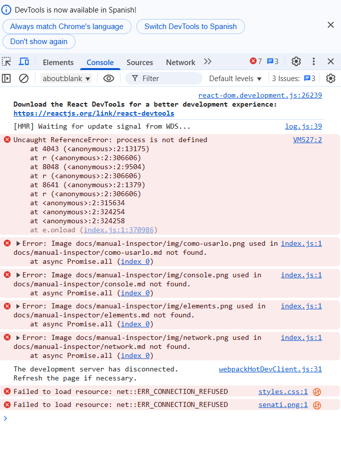

## 🤖 ¿Qué es la Consola?
La consola es una herramienta de depuración que muestra:
- Mensajes de JavaScript (logs, errores, advertencias)
- Resultado de comandos ejecutados
- Problemas de carga de recursos

## Cómo abrir la consola
1. Presiona `F12` o `Ctrl+Shift+I` (Windows/Linux)
2. Selecciona la pestaña "Console"
3. Alternativa: Click derecho → "Inspeccionar"

## Ejemplo práctico con errores


### Errores detectados en esta imagen:

---

### 1️⃣ Error de imagen faltante
```bash
Error: Image 'docs/manual-inspector/img/console.png' not found
```

**Causa:**  
La ruta a la imagen especificada no existe o está mal escrita.

**Solución:**  
Verificar que la imagen esté en la ruta correcta. Por ejemplo:
```
docs/manual-inspector/img/console.png
```
Si no existe, súbela o corrige la ruta en el archivo `.md` que la llama.

---

### 2️⃣ Error `process is not defined`
```javascript
Uncaught ReferenceError: process is not defined
```

**Causa:**  
Este error ocurre cuando se intenta acceder a `process` (una variable global de Node.js) en un entorno de navegador, donde no está disponible.

**Solución:**  
Si estás usando Webpack o Vite, define un polyfill o evita que se use `process` en el frontend. Por ejemplo, en Webpack 5:

```javascript
resolve: {
  fallback: {
    process: require.resolve("process/browser")
  }
}
```

Y en tu archivo principal:
```javascript
import process from 'process';
window.process = process;
```

---

### 3️⃣ `Failed to load resource: net::ERR_CONNECTION_REFUSED`
```bash
Failed to load resource: net::ERR_CONNECTION_REFUSED
```

**Causa:**  
La aplicación intenta cargar recursos (CSS o imágenes) desde un servidor que no está activo o no responde.

**Solución:**  
Verifica que el servidor de desarrollo esté ejecutándose. Si estás usando React, Webpack o Vite, asegúrate de tener activo el servidor:
```bash
npm start
```
o  
```bash
yarn dev
```

---

### 4️⃣ The development server has disconnected
```bash
The development server has disconnected.
```

**Causa:**  
El servidor de desarrollo se detuvo o perdió conexión con el navegador.

**Solución:**  
Refrescar la página o reiniciar el servidor:
```bash
Ctrl + C
npm start
```

---

## ✅ Conclusión
La consola es esencial para detectar y resolver errores en tiempo real. Revisar detenidamente los mensajes permite identificar rápidamente problemas