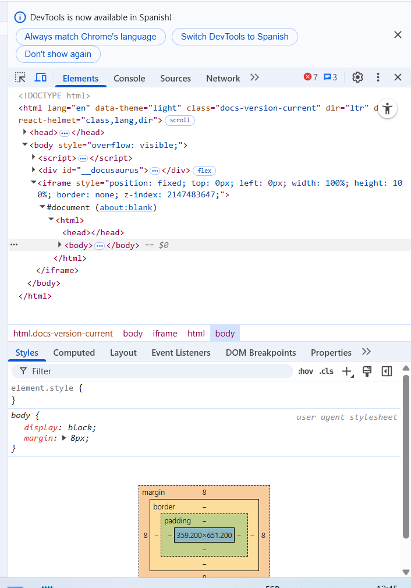

## 🧊 ¿Qué es la pestaña Elements?

Permite **ver, editar y depurar** el HTML y CSS de una página web en tiempo real. Esencial para desarrolladores, diseñadores y creadores de contenido.

## Funcionalidades principales

### 1. Inspección de elementos
- **Cómo seleccionar**:
  - Usa el **icono de selección (🔍)** o el atajo:  
    `Ctrl+Shift+C` (Windows/Linux) / `Cmd+Shift+C` (Mac)
  - Haz clic derecho en cualquier elemento → **"Inspeccionar"**
- **Qué puedes ver**:
  - Estructura completa del DOM
  - Clases y atributos de cada elemento
  - Modelo de caja (márgenes, padding, bordes)

### 2. Edición en tiempo real
- **HTML**:
  - Doble clic en cualquier elemento o texto para modificarlo
  - Click derecho → **"Edit as HTML"** para bloques completos
  - Ejemplo práctico:  
    ```html
    <!-- Cambiar esto -->
    <button class="btn">Enviar</button>
    
    <!-- A esto -->
    <button class="btn btn-primary" disabled>Enviar</button>
    ```

- **CSS**:
  - Panel **Styles** para modificar reglas existentes
  - Botón **+.cls** para añadir nuevas clases
  - Botón **+** para crear reglas CSS nuevas
  - Ejemplo útil:  
    ```css
    /* Modificar estilos de navegación */
    nav {
      background-color: #2c3e50;
      padding: 1rem 2rem;
    }
    ```

### 3. Herramientas avanzadas
- **Modelo de caja**:
  - Visualiza márgenes, padding y bordes
  - Identifica problemas de alineación
- **Estados pseudo-clase**:
  - Force states como `:hover`, `:active` o `:focus`
- **Accesibilidad**:
  - Revisa contrastes de color
  - Verifica roles ARIA

## Casos prácticos comunes

1. **Problema**: "Mi botón no cambia de color"
   - Solución: Busca reglas CSS tachadas (indicando que están siendo anuladas)

2. **Problema**: "No encuentro dónde está definido este estilo"
   - Solución: Usa **"Computed"** para ver la cascada completa

3. **Problema**: "Necesito probar un diseño responsive"
   - Solución: Usa el **modo dispositivo (📱)** junto con Elements

## Consejos profesionales
- **Atajos útiles**:
  - `Esc`: Muestra/oculta la consola
  - `Ctrl+F`: Busca en el DOM
  - `Alt+Click`: Expande/colapsa todos los nodos
- **Truco**: Puedes arrastrar elementos en el DOM para reordenarlos


*Interfaz del inspector de elementos mostrando HTML y CSS*