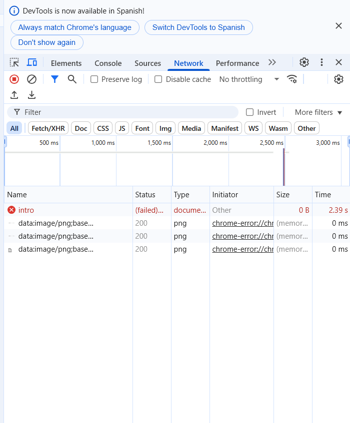

## 🌐 ¿Qué es la pestaña Network?
La pestaña **Network** de las DevTools permite ver todas las peticiones que realiza la página web. Aquí se pueden inspeccionar:
- Archivos de imagen
- Hojas de estilo CSS
- Scripts JS
- Llamadas a APIs
- Peticiones a fuentes externas
- Cualquier recurso que cargue el navegador

Es ideal para detectar:
- Recursos que no cargan correctamente
- Archivos que demoran demasiado
- Verificar las respuestas de APIs
- Revisar errores de conexión

## ¿Cómo abrirla?
1. Presiona `F12` o `Ctrl+Shift+I` (Windows/Linux)
2. Ve a la pestaña **Network**
3. Refresca la página (`F5`) para ver las peticiones desde el inicio

## Ejemplo práctico

### Errores detectados en esta imagen:

---

### 1️⃣ Error `intro (failed) document`
**Causa:**  
El navegador intentó cargar un recurso llamado `intro` (probablemente una ruta o archivo) y falló.

**Posibles causas:**
- El archivo no existe
- Error en la URL configurada
- El servidor no responde o no está disponible

**Solución:**
- Verificar la ruta o URL desde donde se intenta cargar el recurso.
- Comprobar si el servidor de desarrollo está corriendo.
- Revisar la configuración del `src` o `href` en el código fuente.

---

### 2️⃣ Carga de imágenes en base64 (`data:image/png;base64`)
**Descripción:**  
Se observan varias imágenes cargadas directamente desde la memoria del navegador mediante codificación `base64`. Esto es común cuando se incrustan imágenes en línea en el HTML o CSS.

**Ventaja:**  
Evita peticiones externas, ya que la imagen ya viene incrustada.

**Desventaja:**  
Puede aumentar el tamaño del documento y dificultar la gestión de recursos.

---

## ✅ Conclusión
La pestaña **Network** permite ver en tiempo real qué archivos se cargan, cuánto tardan y si hay errores. Es indispensable para depurar problemas de carga, tiempos de respuesta o rutas incorrectas.

**Consejo:**  
Siempre revisar esta pestaña cuando una imagen, script o recurso no aparece en la web o se comporta de forma inesperada.
